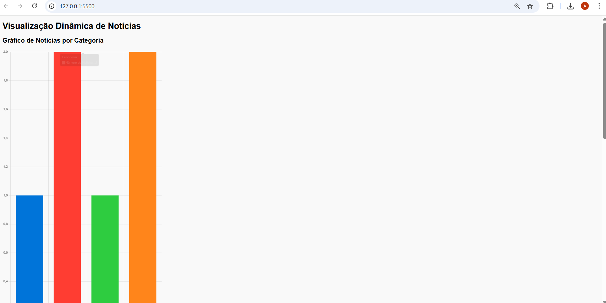
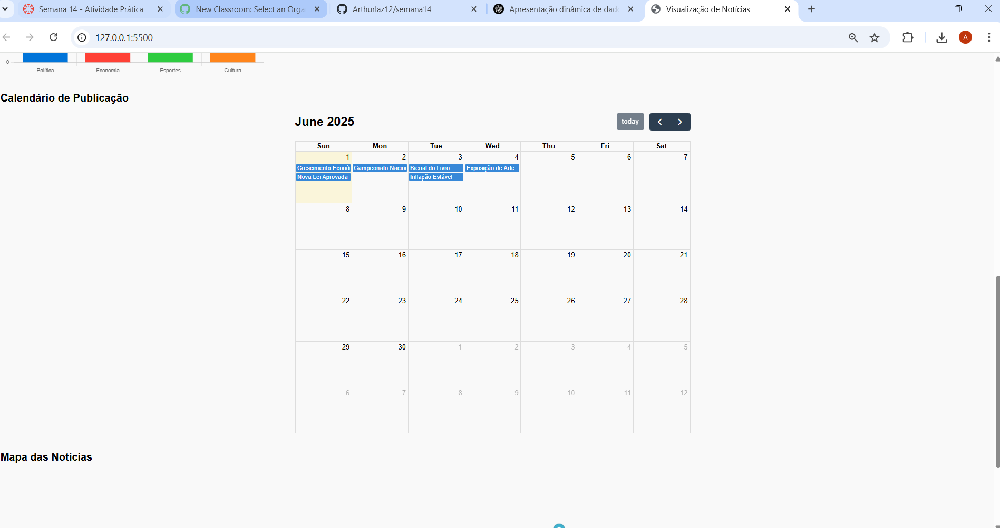
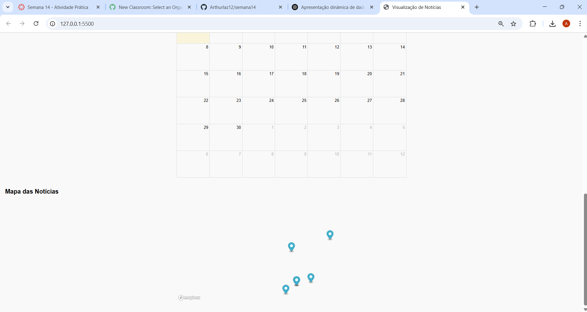

# Visualização Dinâmica de Notícias 📰

## Autor
Arthur Laz

## Descrição
Projeto desenvolvido na disciplina de Desenvolvimento Web para exibir dados de notícias com:
- 📊 Gráfico de barras com quantidade de notícias por categoria (Chart.js)
- 📅 Calendário com publicações por data (FullCalendar)
- 🗺️ Mapa com origem das notícias por cidade (Mapbox)

## Funcionalidades
- Uso de bibliotecas externas
- Manipulação de dados via JSON
- Integração visual e interativa com dados reais

## Prints
### Gráfico por Categoria:


### Calendário de Publicações:


### Mapa das Localidades:


## Execução Local
1. Clone o repositório:
```bash
git clone https://github.com/Arthurlaz12/semana14.git
